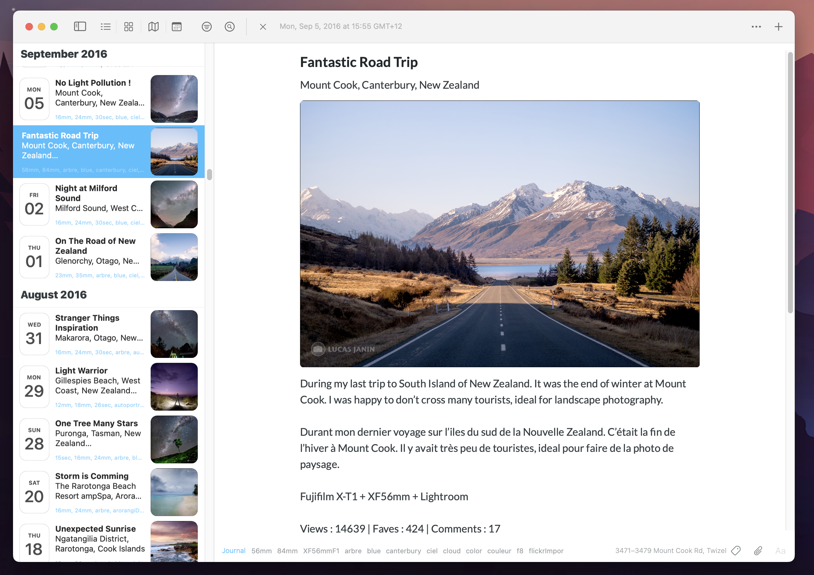
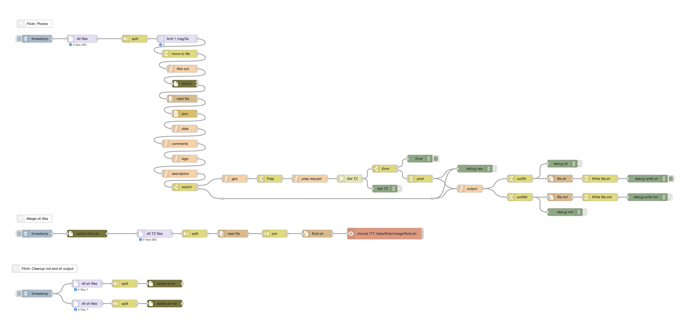

# Flickr2DayOne

After being present for many years on [Flickr](https://www.flickr.com/photos/lucas3d), I decided to import all my 980 photos with descriptions, GPS, tags and comments on Day One. I didn't find a solution for this process, so I decided to use my favourite tool, Node-Red. This import is using the archive exported for Flickr. It isn't working live when you add a new photo to Flickr.
 
There is the result of the importation with a small hand change (moving the picture to the top of the entry).



## Prerequirements

Of cause, you need to install [Node-Red](https://nodered.org). It can be done on a server or your Mac using Docker. Be careful, this software is very addictive! :-).

You need to add some custom nodes to your Node-Red

* [node-red-contrib-fs-ops](https://flows.nodered.org/node/node-red-contrib-fs-ops): A Node Red node for performing file system operations
* [node-red-contrib-fs](https://flows.nodered.org/node/node-red-contrib-fs): Node-Red nodes that work with the host filing system

You need to install the [Day One CLI](https://dayoneapp.com/guides/tips-and-tutorials/command-line-interface-cli/) on your Mac:
```
sudo bash /Applications/Day\ One.app/Contents/Resources/install_cli.sh
```
## Prep Flickr Data

You need to download your data on the Flickr website. You can use "Download all your content (Flickr Data)" on the [Flickr Help](https://www.flickrhelp.com/hc/en-us/articles/4404079675156-Downloading-content-from-Flickr). This is composed of a zip file of the JSON files and one or multiple zip files for the photos (depending on the size of the Flickr library).

Create the folder /data/flickr/ with permission 777 in your Node-Red.
On my side, Node-Red run in a Docker container on my Synology NAS, my local path of the JSON files is:
```
/Volumes/docker/nodered/flickr/
```
Copy the Flickr's JSON files to this folder.

You need to extract the zip files of the photos and copy them to your computer (not in Node-Red docker).
For me this path is:
```
~/Documents/DayOne/Flickr/Photos/
```

## GPS -> Timezone

GPS data need to be converted into Timezone. After using deferents services, I decided to use [TimezoneDB](https://timezonedb.com/register]). It's free with registration. After creating your account, get your API key and add it to the node "prep request".

The free version has a limit of requests (one every second). This "limitation" can slow down the process for a very large library. On my side, it takes 50 minutes to process my 980 photos. 

## Output

The flow will create two types of files for each photo:
* sh: CLI command to generate the entry, there is an [example](photo_4481220450_example.sh) of this file 
* md: Text of the entry, there is an [example](photo_4481220450_example.md) of this file 

You can check the number of files generated in the terminal using "ls | wc -l" in the output folder: 
```
ls | wc -l /Volumes/docker/nodered/flickr/output/sh/
```
When this part is done, you use de bottom section to merge the sh files.
```
/Volumes/docker/nodered/flickr/merge/flickr.sh
```
You can execute this script to create the entries on Day One.

## Current limitations

The time of the entry isn't matching the taken time information from Flickr due to timezone issue.
I contacted DayOne's developer for clarification about the CLI command.

## The flow



The code: 

Feel free to contact me with any questions.